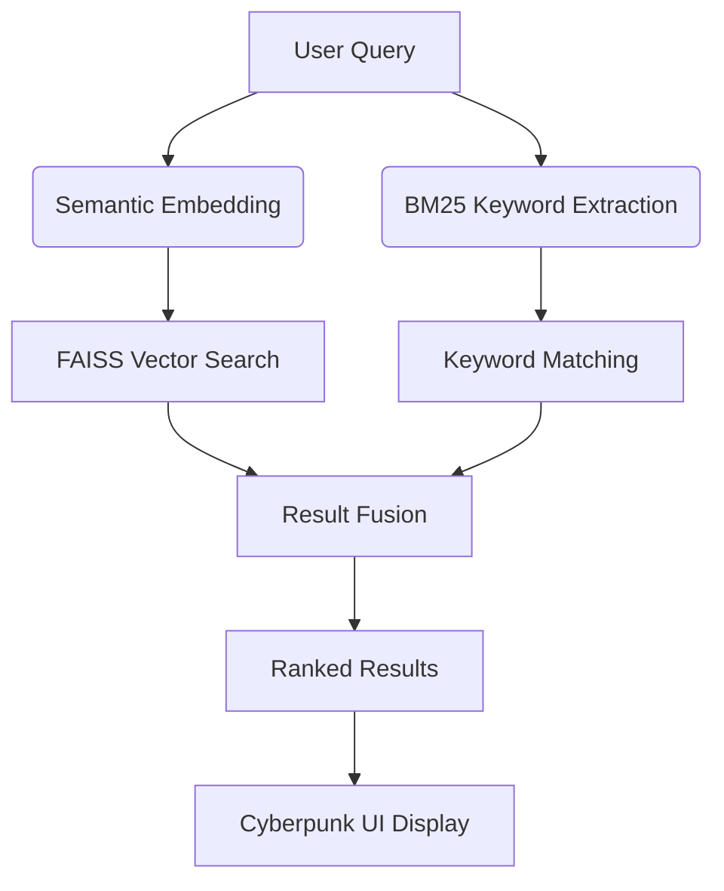

# ToolHunt 🔍
*Advanced Cybersecurity Arsenal Discovery Platform*

<p align="center">
  
</p>

<p align="center">
  <strong>Discover. Deploy. Defend.</strong>
</p>

<p align="center">
  
  
  
  
</p>

---

## 🌟 Overview

ToolHunt is your ultimate cybersecurity tool discovery platform, featuring **3,000+ security tools** in a searchable database. With advanced semantic search capabilities, it helps security professionals, penetration testers, and researchers quickly find the perfect tools for their specific missions using natural language queries.

---

## 🚀 Key Features

| Feature | Description |
|---------|-------------|
| 🔍 **Semantic Search Engine** | Advanced AI-powered search using sentence transformers and FAISS vector similarity |
| 🗃️ **Comprehensive Database** | 3,000+ cybersecurity tools across multiple categories and specialties |
| ⚡ **Hybrid Search Algorithm** | Combines semantic search with BM25 keyword matching for optimal relevance |
| 🎮 **Cyberpunk Interface** | Immersive terminal-inspired dark UI with animated backgrounds |
| ☁️ **Cloud Deployment** | One-click Google Colab deployment with ngrok tunneling |
| 📱 **Responsive Design** | Works seamlessly on desktop, tablet, and mobile devices |

---

## 🎥 Live Demo

<p align="center">
  
</p>

---

## 📸 Screenshots

### Main Search Interface

*Cyberpunk-styled main interface with immersive terminal aesthetic*

### Search Results

*Intelligent tool categorization with detailed descriptions*

---

## 🛠️ Technology Stack

### Frontend
| Technology | Purpose |
|------------|---------|
|  | Structure & Semantics |
|  | Cyberpunk Styling |
|  | Dynamic Interactions |
|  | Security Icons |

### Backend
| Technology | Purpose |
|------------|---------|
|  | Web Framework |
|  | Core Language |

### Search Engine
| Technology | Purpose |
|------------|---------|
|  | Similarity Search |
|  | Sentence Embeddings |
|  | Vector Similarity |
|  | Keyword Matching |

---

## 📁 Project Structure

```plaintext
ToolHunt/
├── 🐍 app.py                      # Main Flask application
├── 🔧 backend/
│   ├── main.py                # Search orchestration
│   ├── semantic_search.py     # Hybrid search implementation
│   └── database/
│       └── tool_list_database.csv  # 3000+ tools database
├── 🎨 templates/
│   └── index.html            # Cyberpunk interface
├── ☁️ toolhunt_in_colab.py      # Google Colab deployment
├── ⚙️ pyproject.toml            # Project configuration
├── 📦 uv.lock                   # Dependency lock
├── 📄 LICENSE                   # GNU License
└── 📖 README.md                 # You are here!
```

---

## 🚀 Quick Start

### Prerequisites
- Python 3.12+
- pip package manager

### Local Installation

```bash
# Clone the repository
git clone https://github.com/cyberytti/ToolHunt.git
cd ToolHunt

# Install dependencies
pip install -r requirements.txt

# Launch ToolHunt
python app.py
```

Access your local instance at: `http://localhost:5000`

### ☁️ One-Click Cloud Deployment

[](https://colab.research.google.com/github/cyberytti/ToolHunt/blob/main/toolhunt_in_colab.py)

1. Click the Google Colab badge above
2. Replace the ngrok authentication token
3. Run all cells
4. Access your public ToolHunt instance via the generated URL

---

## 🔍 Usage Examples

| Search Type | Example Queries |
|-------------|-----------------|
| **Network Security** | `"network scanner"`, `"port enumeration tools"` |
| **Web Application** | `"sql injection tools"`, `"web vulnerability scanner"` |
| **Password Attacks** | `"password cracking utilities"`, `"brute force tools"` |
| **Forensics** | `"digital forensics analysis"`, `"memory analysis tools"` |
| **Reconnaissance** | `"OSINT gathering tools"`, `"subdomain enumeration"` |

---

## 💾 Database Schema

The comprehensive database includes:

| Field | Description |
|-------|-------------|
| **Tool Name** | Official tool name |
| **Description** | Detailed functionality description |
| **Category** | Primary cybersecurity category |
| **Link** | Official documentation/download URL |
| **Platform** | Supported operating systems |

---

## 🤖 Search Architecture



---

## 🤝 Contributing

We welcome contributions from the cybersecurity community!

### Development Process
1. 🍴 Fork the repository
2. 🌿 Create a feature branch (`git checkout -b feature/amazing-feature`)
3. 💻 Make your changes
4. ✅ Test thoroughly
5. 📝 Commit your changes (`git commit -m 'Add amazing feature'`)
6. 📤 Push to the branch (`git push origin feature/amazing-feature`)
7. 🔀 Open a Pull Request

### Guidelines
- Follow PEP 8 style guidelines
- Maintain the cyberpunk aesthetic
- Test search functionality with various queries
- Update documentation for new features

---

## ⚖️ Ethical Use

> **Important**: ToolHunt is designed for legitimate cybersecurity purposes only.

**Responsible Usage Guidelines:**
- 🔒 Use only on systems you own or have explicit permission to test
- 📜 Comply with all applicable laws and regulations
- 🤝 Follow responsible disclosure practices
- 📋 Respect terms of service for included tools

---

## 📄 License

This project is licensed under the **GNU License** - see the [LICENSE](LICENSE) file for details.

---

<p align="center">
  <strong>ToolHunt 🔍 - Empowering Cybersecurity Professionals Worldwide</strong>
</p>

<p align="center">
  <sub>Built with ❤️ by the cybersecurity community</sub>
</p>

<p align="center">
  <a href="https://github.com/cyberytti/ToolHunt/stargazers">
    
  </a>
  <a href="https://github.com/cyberytti/ToolHunt/fork">
    
  </a>
</p>
